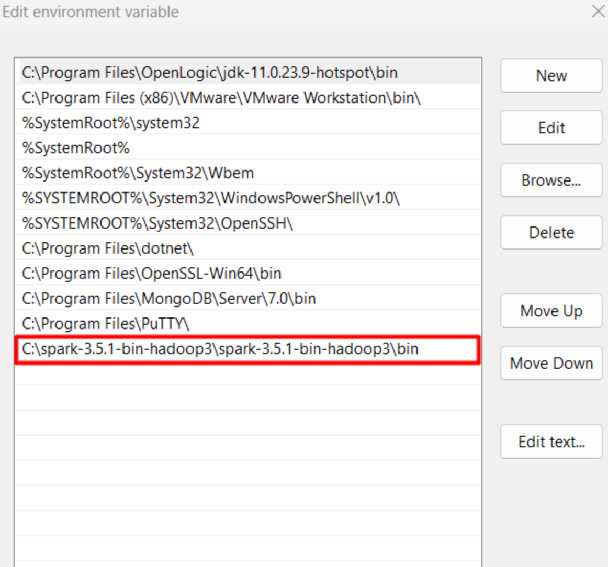
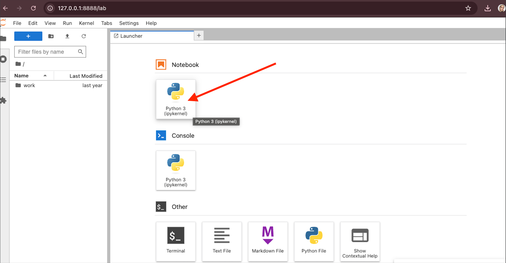
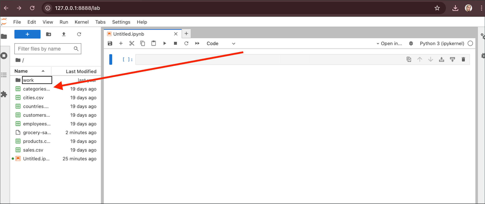

# Apache Spark 3 & PySpark Installation Guide

This guide provides step-by-step instructions for installing **Apache Spark 3** and **PySpark**, **macOS** and via Docker.

---

## **Installation on macOS**

#### **1. Install via Homebrew (Recommended)**
```sh
brew install apache-spark
```

#### **2. Install Python**

```sh
brew install python
echo 'alias python=python3' >> ~/.zshrc
source ~/.zshrc
```
```sh
echo 'alias pip=pip3' >> ~/.zshrc
source ~/.zshrc
```

#### **3. Set up environment variables:**
```sh
echo 'export JAVA_HOME="/opt/homebrew/opt/openjdk@17"' >> ~/.zshrc
echo 'export PATH="$JAVA_HOME/bin:$PATH"' >> ~/.zshrc
source ~/.zshrc
```

#### **4. Install pyspark:**
Create new Python project using pyCharm.
Run in terminal:
```sh
pip install pyspark
```


## **Installation on Windows**

Installing Spark on Windows could be complicated, so I suggest you to use this [guide](https://ultahost.com/knowledge-base/install-spark-on-windows/).

### **1. Install Java**
### Java Installation on Windows

This guide will help you install Java Development Kit (JDK) on a Windows machine.

### Prerequisites
- A Windows operating system (Windows 10 or later).
- Administrator access to install software.

#### Step 1: Download Java JDK
1. Go to the official [Oracle JDK download page](https://www.oracle.com/java/technologies/javase-jdk11-downloads.html) or the [OpenJDK download page](https://adoptopenjdk.net/).
2. Choose the latest stable version (e.g., JDK 17 or 11).
3. Download the appropriate installer for your system (64-bit).

#### Step 2: Install Java JDK
1. Run the downloaded installer (`.exe` file).
2. Follow the installation steps. You can accept the default options, but make sure to note the installation path (e.g., `C:\Program Files\Java\jdk-17.0.1`).
3. Ensure the box **"Set JAVA_HOME variable"** is checked during installation, or you will need to set it manually later.

#### Step 3: Set Up Environment Variables
##### 1. **JAVA_HOME**
   - Right-click on **This PC** or **My Computer** and choose **Properties**.
   - Click on **Advanced system settings** and then **Environment Variables**.
   - Under **System variables**, click **New** and enter the following:
     - **Variable name**: `JAVA_HOME`
     - **Variable value**: The path where the JDK is installed (e.g., `C:\Program Files\Java\jdk-17.0.1`).

##### 2. **Update Path**
   - In **System variables**, find the **Path** variable and click **Edit**.
   - Add a new entry for Java:
   - `C:\Program Files\Java\jdk-17.0.1\bin` (adjust the path based on your installation).

##### Step 4: Verify Installation
1. Open **Command Prompt** (`cmd`).
2. Run the following command to verify the installation:
```sh
   java -version
```

#### **2 Download the Apache Spark Binary Package**
1. Download the Apache Spark binary [package](https://spark.apache.org/downloads.html).
#### **3 Extract the Spark Binary Package**
1. Extract the Spark Binary Package you have downloaded. It is **_strongly recommended_** to create a dedicated folder, such as "spark," on your C:\ drive to maintain a well-organized installation structure.
#### **4 Set the Environment Variable**

#### **5 Verify Apache Spark Installation**

```sh
   spark-shell --version
```
#### **3. Install pyspark:**
Create new Python project using pyCharm.
Run in terminal:
```sh
pip install pyspark
```


## **Installation via Docker**

#### **1. Install Docker**
Install Docker if it is not installed yet. 
How to install on [MacOS](https://docs.docker.com/desktop/setup/install/mac-install/).
How to install on [Windows](https://docs.docker.com/desktop/setup/install/windows-install/).

#### **2. Run Docker container**
```sh
docker run -it -p 8888:8888 jupyter/pyspark-notebook
```

#### **3. Open Jupyter**
Copy URL with token and paste into your browser:


```sh
http://127.0.0.1:8888/lab?token=<token>
```


#### **3. Add dataset**
1. Open new terminal/PowerShell, run docker ps and copy container id:

```sh
docker ps
```


2. Open an Interactive Bash Shell. If you want to execute commands inside the container, open a bash session:
```sh
docker exec -it <CONTAINER_ID_or_NAME> bash
```
You can list your files running:
```sh
ls -l
```


4. Download file to the container:
```sh
curl -L -o ~/grocery-sales-dataset.zip  https://www.kaggle.com/api/v1/datasets/download/andrexibiza/grocery-sales-dataset
```
5. Unzip zip:
```sh
unzip grocery-sales-dataset.zip
```
Now dataset is available from the jupyter notebook.


You can also copy file from your local machine.
Run this command from terminal/PowerShell from your local machine (**_not from container_**):
```sh
docker cp <local_file_path> <container_id_or_name>:<destination_path_in_container>
```